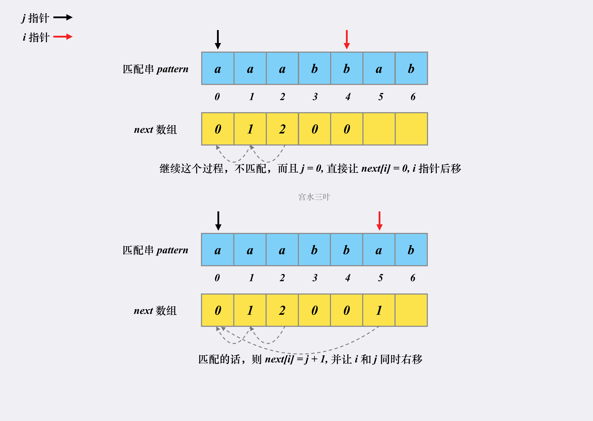

# 题目链接

https://leetcode.cn/problems/find-the-index-of-the-first-occurrence-in-a-string/

# 题目【简单】

给你两个字符串 haystack 和 needle ，请你在 haystack 字符串中找出 needle 字符串的第一个匹配项的下标（下标从 0 开始）。如果 needle 不是 haystack 的一部分，则返回  -1 。

# 示例

```js
示例 1：
输入：haystack = "sadbutsad", needle = "sad"
输出：0
解释："sad" 在下标 0 和 6 处匹配。
第一个匹配项的下标是 0 ，所以返回 0 。

示例 2：
输入：haystack = "leetcode", needle = "leeto"
输出：-1
解释："leeto" 没有在 "leetcode" 中出现，所以返回 -1 。
```

# 题解

- https://www.zhihu.com/question/21923021/answer/281346746
- https://www.zhihu.com/question/21923021/answer/1032665486

## 工具函数

```js
/**
 * @param {string} haystack
 * @param {string} needle
 * @return {number}
 */
var strStr = function(haystack, needle) {
    return haystack.indexOf(needle);
};
```

## 暴力求解

- 时间复杂度：O(n×m)，其中 n 是字符串 haystack 的长度，m 是字符串 needle 的长度。最坏情况下我们需要将字符串 needle 与字符串 haystack 的所有长度为 m 的子串均匹配一次。
- 空间复杂度：O(1)。我们只需要常数的空间保存若干变量。

```js
/**
 * @param {string} haystack
 * @param {string} needle
 * @return {number}
 */
var strStr = function(haystack, needle) {
    let n = haystack.length, m = needle.length;
    for (let i = 0; i + m <= n; i++) {
        let flag = true; // 标识已经找到，后面有也不继续找了
        for(let j = 0; j < m; j++) {
            if (haystack[i + j] !== needle[j]) { // 使用 i + j 获取字符
                flag = false;
                break;
            }
        }
        if (flag) return i;
    }
    return -1;
};
```

## KMP算法

- 时间复杂度：复杂度为 O(m + n)。n 为原串的长度，m 为匹配串的长度。
- 空间复杂度：复杂度为 O(m)。构建了 next 数组。

作者：宫水三叶
链接：https://leetcode.cn/problems/find-the-index-of-the-first-occurrence-in-a-string/solutions/575568/shua-chuan-lc-shuang-bai-po-su-jie-fa-km-tb86/
来源：力扣（LeetCode）
著作权归作者所有。商业转载请联系作者获得授权，非商业转载请注明出处。

```js
/**
 * @param {string} haystack
 * @param {string} needle
 * @return {number}
 */
var strStr = function(haystack, needle) {
    if(!needle) return 0;
    const n = haystack.length,
        m = needle.length;
    const next = new Array(m).fill(0); // next[0] = 0;
    // 遍历子串构建next数组
    for (let i = 1, j = 0; i < m; i++) {
        // 1.如果 j === 0, needle[i] !== needle[j] 则 next[i] = 0, i 往后移动，next数组里默认值为0
        // 2.needle[i] !== needle[j] 则将 j 指针指向前一位置的next数组所对应的值，即 j = next[j - 1];
        while (j > 0 && needle[i] !== needle[j]) {
            j = next[j - 1];
        }
        // 3.needle[i] == needle[j] 则 next[i] = j + 1; i 和 j同时后移
        if (needle[i] == needle[j]) { 
            j++;
        }
        next[i] = j;
    }
    // 遍历原串找到子串并返回
    for (let i = 0, j = 0; i < n; i++) {
        while (j > 0 && haystack[i] != needle[j]) {
            j = next[j - 1];
        }
        if (haystack[i] == needle[j]) {
            j++;
        }
        if (j === m) {
            return i - m + 1;
        }
    }
    return -1;
};
```

### KMP算法的原理

#### 1. 匹配过程

匹配串会检查之前已经匹配成功的部分中里是否存在相同的「前缀」和「后缀」。如果存在，则跳转到「前缀」的下一个位置继续往下匹配：
  
跳转到下一匹配位置后，尝试匹配，发现两个指针的字符对不上，并且此时匹配串指针前面不存在相同的「前缀」和「后缀」，这时候只能回到**匹配串**的起始位置重新开始：  


KMP 为什么更快：

- 因为 KMP 利用已匹配部分中相同的「前缀」和「后缀」来加速下一次的匹配。
- 因为 KMP 的原串指针不会进行回溯（一直往后走）。

其实是意味着：随着匹配过程的进行，原串指针的不断右移，我们本质上是在不断地在否决一些「不可能」的方案。

当我们的原串指针从 i 位置后移到 j 位置，不仅仅代表着「原串」下标范围为 [i,j) 的字符与「匹配串」匹配或者不匹配，更是在否决那些以「原串」下标范围为 [i,j) 为「匹配发起点」的子集。

#### 2. 分析实现

检查「前缀」和「后缀」的目的其实是「为了确定匹配串中的下一段开始匹配的位置」。

**对于匹配串的任意一个位置而言，由该位置发起的下一个匹配点位置其实与原串无关。**

例如，对于匹配串 abcabd 的字符 d 而言，由它发起的下一个匹配点跳转必然是字符 c 的位置。因为字符 d 位置的相同「前缀」和「后缀」字符 ab 的下一位置就是字符 c。

从匹配串某个位置跳转下一个匹配位置这一过程是与原串无关的，我们将这一过程称为找 next 点。

我们可以预处理出 next 数组，数组中每个位置的值就是该下标应该跳转的目标位置（ next 点）。

#### 3.next 数组的构建

假设有匹配串 aaabbab，我们来看看对应的 next 是如何被构建出来的。





这就是整个 next 数组的构建过程，时空复杂度均为 O(m)。
至此整个 KMP 匹配过程复杂度是 O(m + n) 的。

