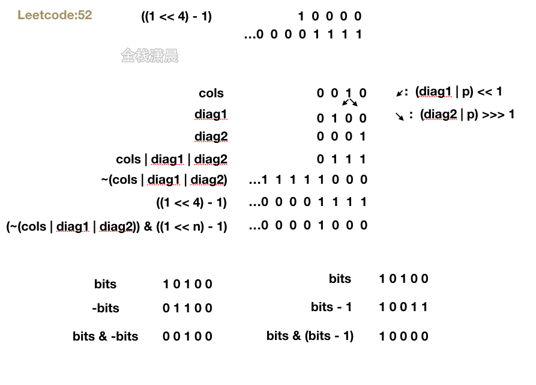

# 题目链接

https://leetcode.cn/problems/n-queens-ii/

# 题目

n 皇后问题 研究的是如何将 n 个皇后放置在 n × n 的棋盘上，并且使皇后彼此之间不能相互攻击。

给你一个整数 n ，返回 n 皇后问题 不同的解决方案的数量。

# 示例

```js
示例 1：
输入：n = 4
输出：2
解释：如上图所示，4 皇后问题存在两个不同的解法。

示例 2：
输入：n = 1
输出：1
```

提示：

- 1 <= n <= 9

# 题解

## 位运算



```js
var totalNQueens = function (n) {
  if (n < 1) return
  let count = 0;
  dfs(n, 0, 0, 0, 0)
  return count

  //n:皇后的数量
  //row：当前行
  //cols：放置皇后的位置
  //diag1：可以攻击的左倾斜对角线
  //diag2：可以攻击的右倾斜对角线
  function dfs(n, row, cols, diag1, diag2) {
      if (row >= n) {//递归终止 统计解法
          count += 1;
          return
      }
      //~(cols | diag1 | diag2)：攻击的位置合起来 取反之后，1的位置就是可以放置皇后的位置
      //(1 << n) - 1：从右向左，大于n的位置都变成0
      //(~(cols | diag1 | diag2)) & ((1 << n) - 1)：从右向左，可以放置皇后的位置，大于n的位置都变成0
      let bits = (~(cols | diag1 | diag2)) & ((1 << n) - 1)
      while (bits) {
          let p = bits & -bits//取到从右向左第一个1
          bits = bits & (bits - 1)//去掉从右向左第一个1
          //列和两个对角线合上不可以放置的二进制位
          dfs(n, row + 1, cols | p, (diag1 | p) << 1, (diag2 | p) >>> 1)
          
      }
  }
};
```
