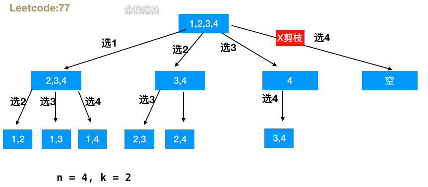

# 题目链接

https://leetcode.cn/problems/combinations/

# 题目

给定两个整数 n 和 k，返回范围 [1, n] 中所有可能的 k 个数的组合。

你可以按 任何顺序 返回答案。

# 示例

```js
示例 1：
输入：n = 4, k = 2
输出：
[
  [2,4],
  [3,4],
  [2,3],
  [1,2],
  [1,3],
  [1,4],
]

示例 2：
输入：n = 1, k = 1
输出：[[1]]
```

提示：

- 1 <= n <= 20
- 1 <= k <= n

# 题解

## 回溯

- 时间复杂度：O(C(n, k) * k)，枚举结果总数为C(n, k)，每次得到一个结果需要O(k)时间。
- 空间复杂度：O(n)，最大是n层递归栈。

思路：回溯函数传入n，k和选择的元素位置startIndex，在每层递归中，从startIndex开始循环到 n - (k - path.length) + 1的位置，将这些数加入path，然后startIndex加1，继续递归函数进入下一个分支，完成调用之后回溯状态，当path的长度等于k的时候终止这层分支，加入结果中。



```js
/**
 * @param {number} n
 * @param {number} k
 * @return {number[][]}
 */

const combine = (n, k) => {
  const res = [];

  const helper = (startIndex, path) => { //startIndex表示搜索的起点位置 path是每条分支的一个组合）
    if (path.length == k) {
      res.push(path.slice());       //需要拷贝一份 避免受其他分支的影响
      return;                       
    }
    for (let i = startIndex; i <= n - (k - path.length) + 1; i++) {//剪枝
      path.push(i);                    //加入path
      helper(i + 1, path);             //下一层递归
      path.pop();                      //回溯状态
    }
  };

  helper(1, []); //递归入口
  return res;
}

var combine = function(n, k) {
    let res = [];
    let path = [];
    if (k <= 0 || n < k) {
        return res;
    }

    dfs(n, k, 1, path, res);
    return res;
};

function dfs(n, k, begin, path, res) {
    if (path.length === k) {
        res.push([...path]);
        return;
    }

    // 搜索起点的上界 + 接下来要选择的元素个数 - 1 = n；接下来要选择的元素个数 = k - path.length，整理得到：搜索起点的上界 = n - (k - path.length) + 1
    for(let i = begin; i <= n - (k - path.length) + 1; i++) { 
        path.push(i);
        dfs(n, k, i + 1, path, res);
        path.pop();
    }
}
```
