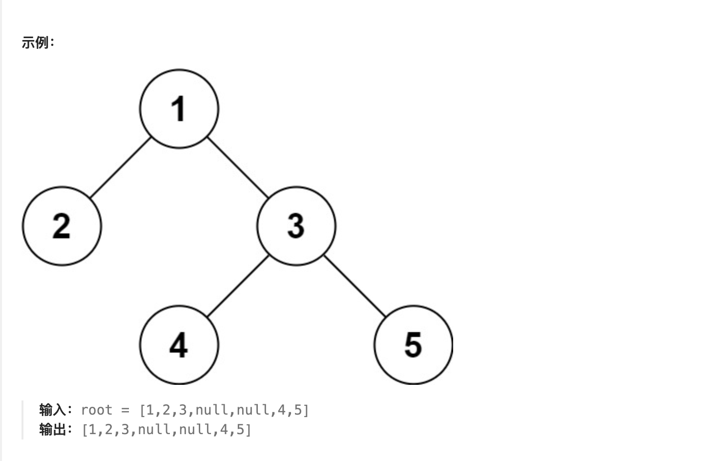

### 题目
请实现两个函数，分别用来序列化和反序列化二叉树。
请设计一个算法来实现二叉树的序列化与反序列化。这里不限定你的序列 / 反序列化算法执行逻辑，你只需要保证一个二叉树可以被序列化为一个字符串并且将这个字符串反序列化为原始的树结构。
### 题目链接
https://leetcode.cn/problems/xu-lie-hua-er-cha-shu-lcof/
### 示例1

### 示例2
```js
输入：root = []
输出：[]
```
### 示例 3：
```js
输入：root = [1]
输出：[1]
```
### 示例 4：
```js
输入：root = [1,2]
输出：[1,2]
```
**提示：**
- 树中结点数在范围 [0, 104] 内
- -1000 <= Node.val <= 1000
- 注意：本题与主站 297 题相同：https://leetcode-cn.com/problems/serialize-and-deserialize-binary-tree/  

### 题解
#### 深度优先搜索
```js
/**
 * Definition for a binary tree node.
 * function TreeNode(val) {
 *     this.val = val;
 *     this.left = this.right = null;
 * }
 */

/**
 * Encodes a tree to a single string.
 *
 * @param {TreeNode} root
 * @return {string}
 */
var serialize = function(root) {
    return rserialize(root, '');
};
const rserialize = (root, str) => {
    if (root === null) {
        str += "None,";
    } else {
        str += root.val + '' + ",";
        str = rserialize(root.left, str);
        str = rserialize(root.right, str);
    }
    return str;
}

/**
 * Decodes your encoded data to tree.
 *
 * @param {string} data
 * @return {TreeNode}
 */
var deserialize = function(data) {
    const dataArray = data.split(",");
    return rdeserialize(dataArray);
};

/**
 * Your functions will be called as such:
 * deserialize(serialize(root));
 */
 const rdeserialize = (dataList) => {
    if (dataList[0] === "None") {
        dataList.shift();
        return null;
    }

    const root = new TreeNode(parseInt(dataList[0]));
    dataList.shift();
    root.left = rdeserialize(dataList);
    root.right = rdeserialize(dataList);

    return root;
}
```
**复杂度分析**
- 时间复杂度：在序列化和反序列化函数中，我们只访问每个节点一次，因此时间复杂度为 O(n)，其中 n 是节点数，即树的大小。
- 空间复杂度：在序列化和反序列化函数中，我们递归会使用栈空间，故渐进空间复杂度为 O(n)。
